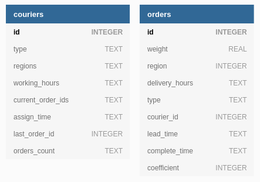

# Table of content

- [Table of content](#table-of-content)
- [Description](#description)
   - [Database](#database)
      - [Diagram](#diagram)
      - [Couriers](#couriers)
      - [Orders](#orders)
   - [Handlers](#handlers)
      - [POST /couriers](#post-couriers)
      - [PATCH /couriers/$courier_id](#patch-courierscourier_id)
      - [POST /orders](#post-orders)
      - [POST /orders/assign](#post-ordersassign)
      - [POST /orders/complete](#post-orderscomplete)
      - [GET /couriers/$courier_id](#get-courierscourier_id)
   - [Tests](#tests)
   - [Libraries](#libraries)
- [Installation](#installation)
   - [Autorun](#autorun)
- [Troubleshooting](#troubleshooting)
   - [Autorun isn't working](#autorun-isnt-working)
   - [Contacts](#contacts)

# Description

This is an implementation of the REST API service for the internet market **'CandyDeliveryShop'**. It can hire couriers, take orders, and favorable distribute orders between couriers.

It uses **Flask** and **SQLite**.

Address of a server of the app after launching: `0.0.0.0:8080`

## Database

The program uses **SQLite** database for storing information about *orders* and *couriers*. It collects 2 tables for orders and couriers, respectively.

### Diagram



### Couriers

Represents the users that will deliver orders with candies. It can assign and complete orders, change personal information and get its own rating with a salary.
Each courier has the following fields:

Field  | Type | Requirements | Description
------------- | ------------- | ------------- | -------------
courier_id | int | Positive integer >= 1 | Identifier
courier_type | enum (dict) | Format string: `foot`, `bike`, `car` | Type of the courier
regions | list of ints | Positive integer >= 1 | The list of regions' id in which the courier works
working_hours | list of strings | Format strings: "`HH:MM-HH:MM`" (`09:30-21:59`) | The list of working hours of the courier
current_order_ids | list of ints | Each element in the list is a positive integer | The list that contains ids of current processing orders
assign_time | string | Format string: `1985-04-12T23:20:50.52Z` | Appointment time of the first full order
last_order_id | int | Positive integer >= 1 | Identifier of the last completed order
orders_count | dict (int : int) | | { region : number of complete orders in that region }

### Orders

Represents the orders that will be delivered by couriers.
Each order has the following fields:

Field  | Type | Requirements | Description
------------- | ------------- | ------------- | -------------
order_id | int | Positive integer >= 1 | Identifier
weight | float | 0.01 <= float <= 50 | Weight of order in kg
region | int | Positive integer >= 1 | Delivery area of the order
delivery_hours | list of string | Format strings: "`HH:MM-HH:MM`" (`09:30-21:59`) | The list of delivery time of the order
type | enum (dict) | Object of type TypeOrder: `READY`, `PROCESSING`, `COMPLETE` | Type of order process. {`READY`, `PROCESSING`, `COMPLETE`}
courier_id | int | Positive integer >= 1 | Identifier of courier who toke the order
lead_time | int	| | Time spent on that order (in seconds)
complete_time | string | Format string: `1985-04-12T23:20:50.52Z` | Time when the order was completed
coefficient | int | | Coefficient of courier's type

## Handlers

More descriptive information in the [Swagger file](docs/swagger.yaml)

### POST /couriers

Import couriers to the system.

#### Example of input data

```graphql
POST /couriers
{
	"data": [
		{
			"courier_id": 1,
			"courier_type": "foot",
			"regions": [1, 12, 22],
			"working_hours": ["11:35-14:05", "09:00-11:00"]
		},
		{
			"courier_id": 2,
			"courier_type": "bike",
			"regions": [22],
			"working_hours": ["09:00-18:00"]
		},
		{
			"courier_id": 3,
			"courier_type": "car",
			"regions": [12, 22, 23, 33],
			"working_hours": []
		},
		...
	]
}
```

#### Output

1. Data is correct: response `HTTP 201 Created` with courier ids.

    ```graphql
    HTTP 201 Created
    {
    	"couriers": [{"id": 1}, {"id": 2}, {"id": 3}]
    }
    ```

2. Data is incorrect (missing fields, incorrect data types): response `HTTP 400 Bad Request` with courier ids where was incorrect data.

    ```graphql
    HTTP 400 Bad Request
    {
    	"validation_error": {
    		"couriers": [{"id": 2}, {"id": 3}]
    	}
    }
    ```

3. No field `courier_id`: response `HTTP 400 Bad Request` with supporting information.

    ```graphql
    HTTP 400 Bad Request
    {
    	"error": "Missing id",
      "object_type": "courier",
      "description": "Object does not have parameter 'courier_id'"
    }
    ```

4. Incorrect request: response `HTTP 400 Bad Request` with supporting information.

    ```graphql
    HTTP 400 Bad Request
    {
    	"error": "Syntax error",
      "description": "Parsing of input JSON is unavailable"
    }
    ```

### PATCH /couriers/$courier_id

Change information about courier with id = `$courier_id`.

#### Example of input data

```graphql
PATCH /couriers/2
{
	"regions": [11, 33, 2]
}
```

#### Output

1. Data is correct: response `HTTP 200 OK` with actual information about the courier.

    ```graphql
    HTTP 200 OK
    {
    	"courier_id": 2,
    	"courier_type": "foot",
    	"regions": [11, 33, 2],
    	"working_hours": ["09:00-18:00"]
    }
    ```

2. Data is incorrect (no fields, nonexistent fields, incorrect data types): response `HTTP 400 Bad Request` with courier id.

    ```graphql
    HTTP 400 Bad Request
    {
    	"validation_error": {
    		"couriers": [{"id": 2}]
    	}
    }
    ```

3. No courier with id from input: response `HTTP 404 Not Found`.

    ```graphql
    HTTP 404 Bad Request
    {
    	"validation_error": {
    		"couriers": [{"id": 3}]
    	}
    }
    ```

4. Incorrect request: response `HTTP 400 Bad Request` with supporting information.

    ```graphql
    HTTP 400 Bad Request
    {
    	"error": "Syntax error",
      "description": "Parsing of input JSON is unavailable"
    }
    ```

### POST /orders

Import orders to the system.

#### Example of input data

```graphql
POST /orders
{
	"data": [
		{
			"order_id": 1,
			"weight": 0.23,
			"region": 12,
			"delivery_hours": ["09:00-18:00"]
		},
		{
			"order_id": 2,
			"weight": 15,
			"region": 1,
			"delivery_hours": ["09:00-18:00"]
		},
		{
			"order_id": 3,
			"weight": 0.01,
			"region": 22,
			"delivery_hours": ["09:00-12:00", "16:00-21:30"]
		},
		...
	]
}
```

#### Output

1. Data is correct: response `HTTP 201 Created` with order ids.

    ```graphql
    HTTP 201 Created
    {
    	"orders": [{"id": 1}, {"id": 2}, {"id": 3}]
    }
    ```

2. Data is incorrect (missing fields, incorrect data types): response `HTTP 400 Bad Request` with order ids where was incorrect data.

    ```graphql
    HTTP 400 Bad Request
    {
    	"validation_error": {
    		"orders": [{"id": 2}, {"id": 3}]
    	}
    }
    ```

3. No field `order_id`: response `HTTP 400 Bad Request` with supporting information.

    ```graphql
    HTTP 400 Bad Request
    {
    	"error": "Missing id",
      "object_type": "order",
      "description": "Object does not have parameter 'order_id'"
    }
    ```

4. Incorrect request: response `HTTP 400 Bad Request` with supporting information.

    ```graphql
    HTTP 400 Bad Request
    {
    	"error": "Syntax error",
      "description": "Parsing of input JSON is unavailable"
    }
    ```

### POST /orders/assign

Assigns orders that match the courier's data.

#### Example of input data

```graphql
POST /orders/assign
{
	"courier_id": 2
}
```

#### Output

1. Data is correct and there are orders for the courier in the database: response `HTTP 200 OK` with order ids and assign time for that set of orders.

    ```graphql
    HTTP 200 OK
    {
    	"orders": [{"id": 1}, {"id": 2}],
    	"assign_time": "2021-01-10T09:32:14.42Z"
    }
    ```

2. Data is correct and there are no orders for the courier in the database: response `HTTP 200 OK` with an empty list of orders.

    ```graphql
    HTTP 200 OK
    {
    	"orders": []
    }
    ```

3. Data is incorrect (no courier with id from input): response `HTTP 400 Bad Request` with supporting information.

    ```graphql
    HTTP 400 Bad Request
    {
    	"validation_error": {
    		"couriers": [{"id": 2}]
    	}
    }
    ```

4. Incorrect request: response `HTTP 400 Bad Request` with supporting information.

    ```graphql
    HTTP 400 Bad Request
    {
    	"error": "Syntax error",
      "description": "Parsing of input JSON is unavailable"
    }
    ```

### POST /orders/complete

Makes the order completed by the courier.

#### Example of input data

```graphql
POST /orders/complete
{
	"courier_id": 2,
	"order_id": 33,
	"complete_time": "2021-01-10T10:33:01.42Z"
}
```

#### Output

1. Data is correct: request `HTTP 200 OK` with id of completed order.

    ```graphql
    HTTP 200 OK
    {
    	"order_id": 33
    }
    ```

2. Data is incorrect (the courier didn't assign the order): request `HTTP 400 Bad Request` with supporting information.

    ```graphql
    HTTP 400 Bad Request
    {
    	"validation_error": {
    		"couriers": [{"id": 2}]
    	}
    }
    ```

3. Data is incorrect (the order was assigned to another courier): request `HTTP 400 Bad Request` with supporting information.

    ```graphql
    HTTP 400 Bad Request
    {
    	"validation_error": {
    		"orders": [{"id": 33}]
    	}
    }
    ```

4. Incorrect request: response `HTTP 400 Bad Request` with supporting information.

    ```graphql
    HTTP 400 Bad Request
    {
    	"error": "Syntax error",
      "description": "Parsing of input JSON is unavailable"
    }
    ```

### GET /couriers/$courier_id

Returns information of the courier with ID from input.

#### Example of input data

```graphql
GET /couriers/2
```

#### Output

1. Data is correct: request `HTTP 200 OK` with full information about the courier.

    ```graphql
    HTTP 200 OK
    {
    	"courier_id": 2,
    	"courier_type": "foot",
    	"regions": [11, 33, 2],
    	"working_hours": ["09:00-18:00"],
    	"rating": 4.93,
    	"earnings": 10000
    }
    ```

2. Data is incorrect (No courier with the ID from input): request `HTTP 404 Not Found` with supporting information.

    ```graphql
    HTTP 400 Bad Request
    {
    	"validation_error": {
    		"couriers": [{"id": 2}]
    	}
    }
    ```

## Tests

The program has tests of functionality.

They are located in the [tests](https://github.com/YeslieSnayder/CandyDeliveryApp/tree/master/tests) directory. Before testing, it is **recommended** to make a backup of the database, and after it, drop the tables: `couriers` and `orders`.

To run the test you should launch the REST API service and launch test files one by one in PyCharm 
by pressing the button `Run all requests in file`.

To be sure in correctness of tests, please drop the tables `couriers` and `rooms` after each test file.

## Libraries

Required **Python** version: `3.8` and above.

- **`Flask`** = `1.1.2` - The main framework for the REST API service.
- **`Jinja2`** = `2.11.3` - Dependency of Flask.
- **`MarkupSafe`** = `1.1.1`
- **`Werkzeug`** = `1.0.1` - Dependency of Flask.
- **`SQLite`** - The main database of that service
- **`Re` -** Used for validation of request data.

# Installation

1. Clone repo: `git clone https://github.com/YeslieSnayder/CandyDeliveryApp.git`
2. Append the project's path to `PYTHONPATH`:
   
If you are using **Ubuntu**: 
```
export PYTHONPATH="${PYTHONPATH}:~/CandyDeliveryApp/"
```
   
If you are using **Windows** (Please, before running this command exchange the path `C:\path\to\the\project` to the current directory where project is located): 
```
set PYTHONPATH=%PYTHONPATH%:C:\path\to\the\project\CandyDeliveryApp
```
3. Open the directory: `cd CandyDeliveryApp/`
4. Install requirements: `pip install -r requirements.txt`
5. Launch the app: `python3 application/api` or if you install PyPy, then `pypy3 application/api`

## Autorun

1. Change the file `auto_run.service` by changing `PATH_TO_DIRECTORY`:
   ```
   [Unit]
   Description=Candy delivery application
   After=multi-user.target

   [Service]
   Type=simple
   WorkingDirectory=PATH_TO_DIRECTORY
   ExecStart=/usr/local/bin/pipenv run python3 PATH_TO_DIRECTORY/application/api

   [Install]
   WantedBy=multi-user.target
   ```

2. Create a file `/lib/systemd/system/candy_delivery_app.service` and copy contents of `auto_run.service` to created file:
   ```
   sudo touch /lib/systemd/system/candy_delivery_app.service
   sudo cp ./auto_run.service /lib/systemd/system/candy_delivery_app.service
   ```
   
3. Reload system configuration systemd: `systemctl daemon-reload`
4. Turn on auto run of the application: `systemctl enable candy_delivery_app.service`

# Troubleshooting

### Autorun isn't working

Try to use another python interpreter, for example, `PyPy`.

Change the string in the configuration file: `ExecStart=/usr/local/bin/pipenv run python3 PATH_TO_DIRECTORY/application/api`
to the `ExecStart=/usr/local/bin/pipenv run pypy3 PATH_TO_DIRECTORY/application/api` with exchanging *PATH_TO_DIRECTORY*.

### Contacts

If you have any problems or suggestions, and want to report that, please contact me 
by email: kuzmickiy2000@mail.ru