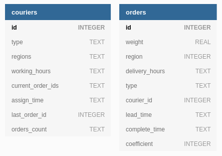

# Содержание

- [Содержание](#содержание)
- [Описание](#описание-проекта)
   - [База данных](#база-данных)
      - [Диаграмма](#диаграмма)
      - [Курьеры](#курьеры)
      - [Заказы](#заказы)
   - [Обработчики](#обработчики)
      - [POST /couriers](#post-couriers)
      - [PATCH /couriers/$courier_id](#patch-courierscourier_id)
      - [POST /orders](#post-orders)
      - [POST /orders/assign](#post-ordersassign)
      - [POST /orders/complete](#post-orderscomplete)
      - [GET /couriers/$courier_id](#get-courierscourier_id)
   - [Тесты](#тесты)
   - [Используемые библиотеки](#используемые-библиотеки)
- [Инструкция по установки](#инструкция-по-установке)
   - [Автоматический запуск сервиса](#добавить-автоматический-запуск-сервиса)
- [Сообщить о проблеме](#сообщить-о-проблеме)
   - [Автоматический запуск сервиса не работает](#автоматический-запуск-сервиса-не-работает)   
   - [Контакты](#контакты)

# Описание проекта

Данный проект - это реализация сервиса REST API для интернет-магазина **'Сласти от всех напастей'**.
Он позволяет нанимать курьеров на работу, принимать заказы и оптимально распределяет заказы между курьерами, 
попутно считая их рейтинг и заработок.

В проекте используются библиотеки: **Flask** и **SQLite**.

Адрес сервера, на котором зарворачивается сервис: `0.0.0.0:8080`

## База данных

В программе используется база данных **SQLite** для хранение информации о *заказах* и *курьерах*.
В ней содержатся 2 таблицы для заказов и курьеров, соответственно.

### Диаграмма



### Курьеры

Объекты типа **couriers** представляют из себя курьеров, которые в дальнейшем будут развозить заказы в виде конфет.
Курьеры могут запросить назначение завершение заказов, изменить информацию о себе и получить информацию о своём рейтинге и зарплате.
Каждый объект курьера имеет следующие поля:

Поле  | Тип | Требование к полю | Описание
------------- | ------------- | ------------- | -------------
courier_id | int | Положительное число (>= 1) | Идентификатор
courier_type | enum (dict) | Формат строки: `foot`, `bike`, `car` | Тип курьера
regions | list of ints | Положительное число (>= 1) | Массив регионов, где работает курьер
working_hours | list of strings | Формат строк в листе: "`HH:MM-HH:MM`" (`09:30-21:59`) | График работы курьера
current_order_ids | list of ints | Каждый элемент в листе - положительное число (>= 1) | Массив, хранящий id текущих заказов, которые выполняет курьер
assign_time | string | Формат строки: `1985-04-12T23:20:50.52Z` | Время назначения последнего множества заказов
last_order_id | int | Положительное число (>= 1) | Идентификатор последнего выполненного заказа
orders_count | dict (int : int) | | { регион : количество выполненных заказов в регионе }

### Заказы

Объекты типа **orders** представляют из себя заказы, которые будут доставляются курьерами.
Объекты данного типа имеют следующие поля:

Поле  | Тип | Требование к полю | Описание
------------- | ------------- | ------------- | -------------
order_id | int | Положительное число (>= 1) | Идентификатор
weight | float | 0.01 <= float <= 50 | Вес заказа в килограммах
region | int | Положительное число (>= 1) | Район доставки заказа
delivery_hours | Лист строк | Формат строк: "`HH:MM-HH:MM`" (`09:30-21:59`) | The list of delivery time of the order
type | enum (dict) | enum в котором есть значения: `READY`, `PROCESSING`, `COMPLETE` | Type of order process. {`READY`, `PROCESSING`, `COMPLETE`}
courier_id | int | Положительное число (>= 1) | Identifier of courier who toke the order
lead_time | int	| | Время потраченное на выполнение заказа (в секундах)
complete_time | string | Формат строки: `1985-04-12T23:20:50.52Z` | Время, когда заказ был завершен
coefficient | int | | Коэффициент типа у курьера (пеший — 2, велокурьер — 5, авто — 9)

## Обработчики

Информация об обработчиках также представленна в файле [Swagger file](docs/swagger.yaml)

### POST /couriers

Обработчик принимает на вход в формате _json_ список с данными о курьерах и графиком их работы.
Курьеры работают только в заранее определенных районах,
а так же различаются по типу: пеший, велокурьер и курьер на автомобиле. От типа курьера
зависит его грузоподъемность — `10 кг`, `15 кг` и `50 кг` соответственно.
Районы задаются целыми положительными числами. График работы задается списком строк формата `HH:MM-HH:MM`.

#### Пример входных данных

```graphql
POST /couriers
{
	"data": [
		{
			"courier_id": 1,
			"courier_type": "foot",
			"regions": [1, 12, 22],
			"working_hours": ["11:35-14:05", "09:00-11:00"]
		},
		{
			"courier_id": 2,
			"courier_type": "bike",
			"regions": [22],
			"working_hours": ["09:00-18:00"]
		},
		{
			"courier_id": 3,
			"courier_type": "car",
			"regions": [12, 22, 23, 33],
			"working_hours": []
		},
		...
	]
}
```

#### Выходные данные

1. Data is correct: response `HTTP 201 Created` with courier ids.

    ```graphql
    HTTP 201 Created
    {
    	"couriers": [{"id": 1}, {"id": 2}, {"id": 3}]
    }
    ```

2. Data is incorrect (Отсутствие полей, некорректные названия у полей, некорректные типы данных): response `HTTP 400 Bad Request` with courier ids where was incorrect data.

    ```graphql
    HTTP 400 Bad Request
    {
    	"validation_error": {
    		"couriers": [{"id": 2}, {"id": 3}]
    	}
    }
    ```

3. No field `courier_id`: response `HTTP 400 Bad Request` with supporting information.

    ```graphql
    HTTP 400 Bad Request
    {
    	"error": "Missing id",
      "object_type": "courier",
      "description": "Object does not have parameter 'courier_id'"
    }
    ```

4. Incorrect request: response `HTTP 400 Bad Request` with supporting information.

    ```graphql
    HTTP 400 Bad Request
    {
    	"error": "Syntax error",
      "description": "Parsing of input JSON is unavailable"
    }
    ```

### PATCH /couriers/$courier_id

Позволяет изменить информацию о курьере с id = `$courier_id`.

#### Пример входных данных

```graphql
PATCH /couriers/2
{
	"regions": [11, 33, 2]
}
```

#### Выходные данные

1. Data is correct: response `HTTP 200 OK` with actual information about the courier.

    ```graphql
    HTTP 200 OK
    {
    	"courier_id": 2,
    	"courier_type": "foot",
    	"regions": [11, 33, 2],
    	"working_hours": ["09:00-18:00"]
    }
    ```

2. Data is incorrect (Отсутствие полей, некорректные названия у полей, некорректные типы данных): response `HTTP 400 Bad Request` with courier id.

    ```graphql
    HTTP 400 Bad Request
    {
    	"validation_error": {
    		"couriers": [{"id": 2}]
    	}
    }
    ```

3. No courier with id from input: response `HTTP 404 Not Found`.

    ```graphql
    HTTP 404 Bad Request
    {
    	"validation_error": {
    		"couriers": [{"id": 3}]
    	}
    }
    ```

4. Incorrect request: response `HTTP 400 Bad Request` with supporting information.

    ```graphql
    HTTP 400 Bad Request
    {
    	"error": "Syntax error",
      "description": "Parsing of input JSON is unavailable"
    }
    ```

### POST /orders

Принимает на вход в формате json список с данными о заказах. Заказы характеризуются весом, районом и
временем доставки.

#### Пример входных данных

```graphql
POST /orders
{
	"data": [
		{
			"order_id": 1,
			"weight": 0.23,
			"region": 12,
			"delivery_hours": ["09:00-18:00"]
		},
		{
			"order_id": 2,
			"weight": 15,
			"region": 1,
			"delivery_hours": ["09:00-18:00"]
		},
		{
			"order_id": 3,
			"weight": 0.01,
			"region": 22,
			"delivery_hours": ["09:00-12:00", "16:00-21:30"]
		},
		...
	]
}
```

#### Выходные данные

1. Data is correct: response `HTTP 201 Created` with order ids.

    ```graphql
    HTTP 201 Created
    {
    	"orders": [{"id": 1}, {"id": 2}, {"id": 3}]
    }
    ```

2. Data is incorrect (Пропущенные поля (кроме `order_id`), Неправильные типы данных): response `HTTP 400 Bad Request` with order ids where was incorrect data.

    ```graphql
    HTTP 400 Bad Request
    {
    	"validation_error": {
    		"orders": [{"id": 2}, {"id": 3}]
    	}
    }
    ```

3. No field `order_id`: response `HTTP 400 Bad Request` with supporting information.

    ```graphql
    HTTP 400 Bad Request
    {
    	"error": "Missing id",
      "object_type": "order",
      "description": "Object does not have parameter 'order_id'"
    }
    ```

4. Incorrect request: response `HTTP 400 Bad Request` with supporting information.

    ```graphql
    HTTP 400 Bad Request
    {
    	"error": "Syntax error",
      "description": "Parsing of input JSON is unavailable"
    }
    ```

### POST /orders/assign

Принимает id курьера и назначает максимальное количество заказов, подходящих по весу, району и графику работы.

#### Пример входных данных

```graphql
POST /orders/assign
{
	"courier_id": 2
}
```

#### Выходные данные

1. Data is correct. Присутствуют заказы, удовлетворяющие параметрам курьера: response `HTTP 200 OK` with order ids and assign time for that set of orders.

    ```graphql
    HTTP 200 OK
    {
    	"orders": [{"id": 1}, {"id": 2}],
    	"assign_time": "2021-01-10T09:32:14.42Z"
    }
    ```

2. Data is correct. Отсутствуют заказы, удовлетворяющие параметрам курьера: response `HTTP 200 OK` with an empty list of orders.

    ```graphql
    HTTP 200 OK
    {
    	"orders": []
    }
    ```

3. Data is incorrect (Нету курьера с данным ID): response `HTTP 400 Bad Request` with supporting information.

    ```graphql
    HTTP 400 Bad Request
    {
    	"validation_error": {
    		"couriers": [{"id": 2}]
    	}
    }
    ```

4. Incorrect request: response `HTTP 400 Bad Request` with supporting information.

    ```graphql
    HTTP 400 Bad Request
    {
    	"error": "Syntax error",
      "description": "Parsing of input JSON is unavailable"
    }
    ```

### POST /orders/complete

Принимает 3 параметра: id курьера, id заказа и время выполнения заказа, отмечает заказ выполненным.

#### Пример входных данных

```graphql
POST /orders/complete
{
	"courier_id": 2,
	"order_id": 33,
	"complete_time": "2021-01-10T10:33:01.42Z"
}
```

#### Выходные данные

1. Data is correct: request `HTTP 200 OK` with id of completed order.

    ```graphql
    HTTP 200 OK
    {
    	"order_id": 33
    }
    ```

2. Data is incorrect (Курьер не назначал заказы): request `HTTP 400 Bad Request` with supporting information.

    ```graphql
    HTTP 400 Bad Request
    {
    	"validation_error": {
    		"couriers": [{"id": 2}]
    	}
    }
    ```

3. Data is incorrect (Заказ был назначен на другого курьера или не назначен вовсе): request `HTTP 400 Bad Request` with supporting information.

    ```graphql
    HTTP 400 Bad Request
    {
    	"validation_error": {
    		"orders": [{"id": 33}]
    	}
    }
    ```

4. Incorrect request: response `HTTP 400 Bad Request` with supporting information.

    ```graphql
    HTTP 400 Bad Request
    {
    	"error": "Syntax error",
      "description": "Parsing of input JSON is unavailable"
    }
    ```

### GET /couriers/$courier_id

Возвращает информацию о курьере и дополнительную статистику: рейтинг и заработок.

#### Пример входных данных

```graphql
GET /couriers/2
```

#### Выходные данные

1. Data is correct: request `HTTP 200 OK` with full information about the courier.

    ```graphql
    HTTP 200 OK
    {
    	"courier_id": 2,
    	"courier_type": "foot",
    	"regions": [11, 33, 2],
    	"working_hours": ["09:00-18:00"],
    	"rating": 4.93,
    	"earnings": 10000
    }
    ```

2. Data is incorrect (Нету курьера с данным ID): request `HTTP 404 Not Found` with supporting information.

    ```graphql
    HTTP 400 Bad Request
    {
    	"validation_error": {
    		"couriers": [{"id": 2}]
    	}
    }
    ```

## Тесты

У программы присутствуют тесты, проверяющие общую функциональность программы.

Они находятся в директории [tests](https://github.com/YeslieSnayder/CandyDeliveryApp/tree/master/tests).
Тесты представляют собой тестовые запросы с данными в json-строке.

Перед запуском тестов, рекомендуемо сделать backup базы данных, и после этого удалить таблицы: `couriers` and `orders`.

Для того, чтобы запустить тесты, необходимо запустить REST API сервис и после этого запустить файлы тестов один за другим в
PyCharm нажав на кнопку `Run all requests in file`.

Для того, чтобы тесты прошли успешно, необходимо удалять таблицы базы данных `couriers` и `rooms` после каждого тестового файла.


## Используемые библиотеки

Необходимая версия **Python**: `3.8` или выше.

- **`Flask`** = `1.1.2` - Фреймворк для запуска REST API сервиса.
- **`Jinja2`** = `2.11.3` - Зависимости Flask.
- **`MarkupSafe`** = `1.1.1`
- **`Werkzeug`** = `1.0.1` - Зависимости Flask.
- **`SQLite`** - Главный тип базы данных данного сервиса.
- **`Re` -** Используется для проверки и обработки данных запроса.

# Инструкция по установке

Все команды были проверенны и протестированны на ОС Ubuntu LTS 20.04. Работа на других версиях и операционных системах не гарантируется.

Для того, чтобы запустить REST API сервис, необходимо проделать следующие шаги:

1. Клонировать репозиторий: `git clone https://github.com/YeslieSnayder/CandyDeliveryApp.git`
2. Добавить путь к проекту `PYTHONPATH`:
   
Если вы используете **Ubuntu**: 
```
export PYTHONPATH="${PYTHONPATH}:~/CandyDeliveryApp/"
```
   
Если вы используете **Windows** (Пожалуйства, проверьте путь перед запуском следующей команды. Путь `C:\path\to\the\project` должен быть заменен на путь до директории с проектом `CandyDeliveryShop`): 
```
set PYTHONPATH=%PYTHONPATH%:C:\path\to\the\project\CandyDeliveryApp
```

3. Войдите в директорию: `cd CandyDeliveryApp/`
4. Установите зависимости: `pip install -r requirements.txt`
5. Запуск приложения: `python3 application/api` 
   или если у вас установлен pypy: `pypy3 application/api`

## Добавить автоматический запуск сервиса

1. Измените файл `auto_run.service` заменив `PATH_TO_DIRECTORY` на директорию к проекту:
   ```
   [Unit]
   Description=Candy delivery application
   After=multi-user.target

   [Service]
   Type=simple
   WorkingDirectory=PATH_TO_DIRECTORY
   ExecStart=/usr/local/bin/pipenv run python3 PATH_TO_DIRECTORY/application/api

   [Install]
   WantedBy=multi-user.target
   ```

2. Создайте файл `/lib/systemd/system/candy_delivery_app.service` и скопируйте содержимое `auto_run.service`:
   ```
   sudo touch /lib/systemd/system/candy_delivery_app.service
   sudo cp ./auto_run.service /lib/systemd/system/candy_delivery_app.service
   ```
   
3. Обновите конфигурацию системы systemd: `systemctl daemon-reload`
4. Подключите : `systemctl enable candy_delivery_app.service`

# Сообщить о проблеме

### Автоматический запуск сервиса не работает

Попробуйте использовать другой интерпретатор Python, например, `PyPy`.

Замените строчку в файле конфигурации: `ExecStart=/usr/local/bin/pipenv run python3 PATH_TO_DIRECTORY/application/api`
на `ExecStart=/usr/local/bin/pipenv run pypy3 PATH_TO_DIRECTORY/application/api`, также заменив путь до проекта *PATH_TO_DIRECTORY*.

### Контакты

Если у вас возникли какие-либо сложности с проектом или есть какие-нибудь советы, прошу вас описать их и сообщить мне удобным для вас способом.
email: kuzmickiy2000@mail.ru